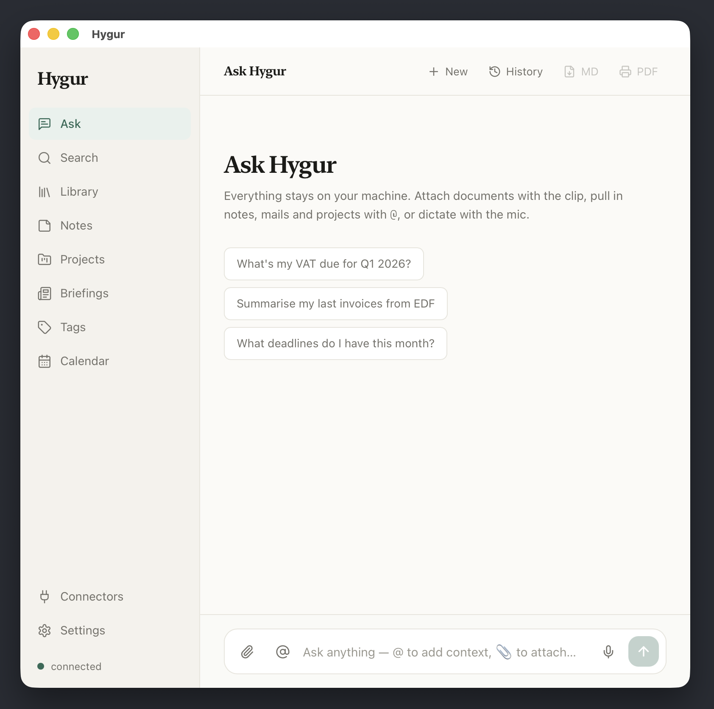

# Hygur

> Your local digital twin — a private memory of your documents, mail and notes, powered by your own LLM.

Hygur is a personal AI knowledge assistant that runs **entirely on your machine**. It indexes your
documents, mail and calendar into a local knowledge base and answers questions over them with
citations — using an LLM runtime you control. No cloud, no account, no data leaving your Mac.



It ships as three pieces:

- **`sidecar/`** — a Go backend that owns the SQLite + vector store, hybrid retrieval (BM25 + embeddings),
  connectors, and an OpenAI-compatible LLM client. It exposes a local REST/SSE API on `127.0.0.1:8420`
  **and serves the web UI** (embedded into the binary via `go:embed`).
- **`webui/`** — a React + TypeScript single-page app (Vite + Tailwind). This is the primary Hygur
  interface. It talks to the sidecar API on the same loopback origin.
- **`webui/src-tauri/`** — a cross-platform desktop shell (Tauri 2 / Rust) that embeds and supervises the
  sidecar, points its window at the sidecar-served UI, and adds the native bits the web layer can't reach:
  tray icon, global hotkey, autostart, and OS notifications.

First-run setup (macOS permissions, AI model, accounts, notifications) runs as a **guided onboarding
wizard inside the web UI**.

## Requirements

| Tool | Version | Used for |
|------|---------|----------|
| macOS | 11.0+ | the desktop app target / build host (Apple Silicon) |
| Go | 1.26+ | building/testing the sidecar |
| Node.js | 20+ & npm | building the web UI |
| [Rust](https://rustup.rs) | stable | building the Tauri desktop shell |
| [gh](https://cli.github.com) | latest | drafting GitHub releases (`brew install gh`) |

You also need an **OpenAI-compatible LLM runtime** running locally or on your network — e.g.
[LM Studio](https://lmstudio.ai), [Ollama](https://ollama.com), [vLLM](https://docs.vllm.ai) or
llama.cpp. Hygur calls its `/v1/chat/completions`, `/v1/embeddings` and `/v1/models` endpoints.

```bash
brew install go node gh && curl https://sh.rustup.rs -sSf | sh
```

## Quick start

```bash
# Build the web UI (required before any Go build — see "Web UI" below) and run
# the Go test suite:
make test

# Build + ad-hoc sign + launch the app (web UI served at http://localhost:8420):
make open
```

On first launch the onboarding wizard walks you through permissions, your AI model, and optional
account connectors.

## Configuration

Everything is tunable from the in-app **Settings** (⌘,) or the onboarding wizard. Settings are
persisted to a YAML file the sidecar owns:

```
~/Library/Application Support/Hygur/
├── config.yaml   # tunable configuration (created on first run)
├── token         # API auth token (auto-generated, see "API")
└── hygur.db      # SQLite knowledge base + vector store
```

> The data directory can be relocated with the `HYGUR_DATA_DIR` environment variable.

### Required parameters

At minimum, point Hygur at your AI runtime. These are set via the onboarding wizard / Settings, or
directly in `config.yaml`:

```yaml
lm_studio:
  url: "http://localhost:1234"          # REQUIRED — OpenAI-compatible inference endpoint
  model_default: "llama-3.1-8b-instruct" # REQUIRED — chat model id
  # --- for semantic search over your documents ---
  embedding_model: "nomic-embed-text"    # embedding model id
  embedding_url: ""                       # optional; empty = reuse `url`
  # --- optional tuning ---
  indexing_url: ""                        # optional separate (fast) model for ingestion-time extraction
  model_indexing: ""                      # optional small model for ingestion (empty = model_default)
  embedding_max_tokens: 512
  embedding_batch_size: 32
```

### Environment variables

| Variable | Purpose |
|----------|---------|
| `HYGUR_DATA_DIR` | Override the data directory (default: `~/Library/Application Support/Hygur`). |
| `HYGUR_CRED_KEY` | Enables encrypted at-rest storage of connector credentials. Set it to enable IMAP/Gmail/etc. secrets. |
| `HYGUR_NO_AUTORESTART` | When set, the sidecar won't self-restart after a config change (useful for headless runs). |
| `HYGUR_PPROF` | Loopback address to expose `net/http/pprof` for profiling. |

## Web UI

The web UI is built by Vite **straight into the Go package that embeds it**
(`sidecar/internal/api/webui/dist`), then bundled into the sidecar binary via `go:embed`. The built
`dist/` is **not committed** — `make` regenerates it. Because the Go package can't compile without it,
any Go build/test of the sidecar must build the web UI first:

```bash
make webui   # npm ci (first run) + vite build → sidecar/internal/api/webui/dist
```

`make` targets that compile Go (`test`, `test-go`, `build-sidecar`, `open`, …) depend on `webui`, so you
rarely call it directly. For isolated UI iteration:

```bash
cd webui
npm install
npm run dev    # Vite dev server (API calls expect a running sidecar on :8420)
npm run lint
```

## Development

### Makefile targets

| Target | Description |
|--------|-------------|
| `make webui` | Build the React/TS web UI into the sidecar's embed dir |
| `make test` | Build web UI → Go tests (race + vet) → sidecar binary → compile the app |
| `make test-go` | Go tests + `go vet` (with the `sqlite_fts5` build tag) |
| `make dev` | Run the sidecar in dev mode |
| `make check-api` | Smoke-test the sidecar API (sidecar must be running) |
| `make open` | Build + ad-hoc sign + launch the app |
| `make dev-cert` | Create a stable local code-signing identity (keeps macOS grants across rebuilds) |
| `make reset-db` | Delete the SQLite knowledge base (destructive; schema is recreated on next launch) |
| `make verify-dmg` | Build a DMG, mount it, verify structure + binary, unmount |
| `make release` | Package a DMG and draft a GitHub release |
| `make clean` | Remove build artifacts |

### Running tests

```bash
# Go: race detector + the sqlite_fts5 tag (FTS5 is a runtime SQLite module the
# lexical index needs — the build is green without it but search breaks at runtime).
cd sidecar && go test -tags sqlite_fts5 -race ./...

# Web UI: type-check + lint.
cd webui && npm run build && npm run lint
```

> Code signing: by default the app is ad-hoc signed, which resets every macOS permission grant
> (Automation, Keychain) on each rebuild. Run `make dev-cert` once to create a stable local signing
> identity so grants survive rebuilds.

## Architecture

```
hygur/
├── sidecar/                      # Go backend (API + embedded web UI)
│   ├── cmd/hygur/                # Entry point
│   └── internal/
│       ├── api/                  # HTTP server, handlers, routes
│       │   └── webui/            # go:embed of the built SPA (dist/ — generated)
│       ├── auth/                 # Token + credential storage
│       ├── config/               # YAML config loader
│       ├── connectors/           # IMAP, Mail.app, CalDAV, Files connectors
│       ├── ingest/               # Parsing, sectioning, chunking, autotag
│       ├── llm/                  # OpenAI-compatible client + embeddings
│       ├── mail/                 # Gmail / IMAP / Mail.app indexers
│       ├── marketplace/          # Connector catalog
│       ├── plugin/               # Connector factory + scheduler
│       ├── retrieval/            # Hybrid RAG (BM25 + vector + fusion)
│       └── store/                # SQLite + FTS5 + vector store
├── webui/                        # React + TS + Vite + Tailwind SPA
│   ├── src/
│   │   ├── views/                # Ask, Search, Library, Notes, Connectors, Settings, …
│   │   ├── onboarding/           # First-run guided setup wizard
│   │   ├── components/           # Shared UI primitives
│   │   └── lib/                  # API client, native bridge, types
│   └── src-tauri/                # Tauri 2 desktop shell (Rust)
│       ├── src/                  # Sidecar supervisor, tray, hotkey, autostart
│       ├── binaries/             # Staged sidecar (externalBin, generated)
│       └── tauri.conf.json       # Bundle + window config
├── .github/workflows/            # CI — release on a v*.*.* tag
└── Makefile                      # Root build orchestration
```

## API

The sidecar exposes a REST/SSE API on `http://localhost:8420`. The `127.0.0.1` bind is the trust
boundary. All routes except `/health` and the web UI shell require the `X-Hygur-Token` header:

```bash
TOKEN=$(cat ~/Library/Application\ Support/Hygur/token)
curl -H "X-Hygur-Token: $TOKEN" http://localhost:8420/marketplace/connectors
```

Key endpoints:

| Endpoint | Method | Description |
|----------|--------|-------------|
| `/health` | GET | Sidecar + inference/embedding reachability |
| `/models` | GET | Models reported by the LLM runtime |
| `/chat` | POST | Streaming SSE RAG chat |
| `/search` | POST | Hybrid search across knowledge + mail |
| `/knowledge/items` | GET | Knowledge base items |
| `/knowledge/upload` | POST | Upload + ingest a file |
| `/notes` | GET/POST | Notes CRUD |
| `/config` | GET/PATCH | Tunable sidecar configuration |
| `/connectors` | GET | Configured connectors + health |
| `/marketplace/connectors` | GET | Connector catalog |
| `/briefings` | GET | Daily + meeting briefings |

## Release

Pushing a `v*.*.*` tag triggers the GitHub Actions release workflow, which builds the web UI and
sidecar, compiles + signs the app, packages a DMG, and publishes a GitHub release:

```bash
git tag v0.3.0
git push origin v0.3.0
```

## License

AGPL-3.0 — see [LICENSE](LICENSE).
